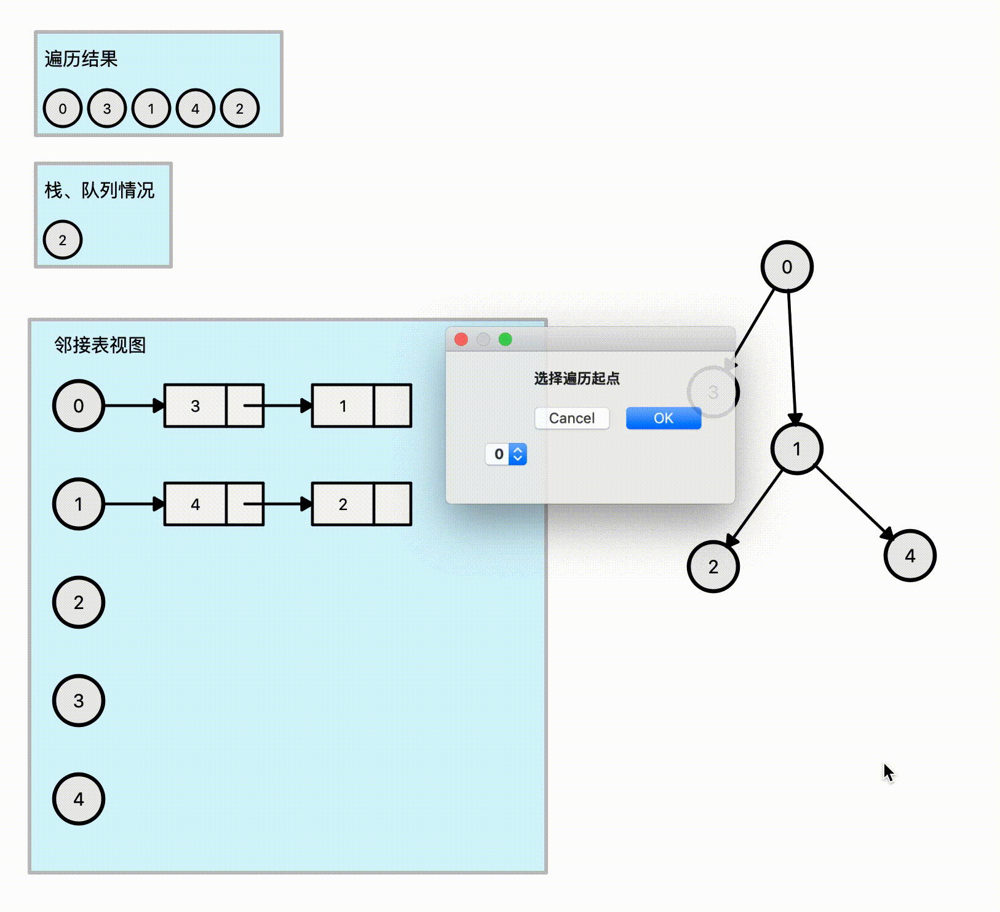

# Graph Visualization

> 同济大学数据结构2019暑期课程设计算法实现题

## Primary Implementations

1. Dynamically create and show a graph with **draggable items**.
  
2. Synchronously render its adjoint list.

3. Graphically show the results of deep first search and breadth first search on the graph and its stack/queue condition.



## Executable

Click 📧!

## Development Environment

- *Operating system:* macOS Mojave 10.14.5
- *GUI library:* C++ Qt
- *IDE:* CLion
  
  > CMake for building

## Build with CMake

[CMakeLists.txt](Graph_DataStructureCourseDesign/CMakeLists.txt) for this project.

### Sample Code

```CMake
cmake_minimum_required(VERSION 3.14)
project(QtTest)

set(CMAKE_CXX_STANDARD 14)

# Qt库的位置
set(CMAKE_PREFIX_PATH /Users/nole/SoftwaresFromInternet/5.13.0/clang_64/lib/cmake)

# 不知道
set(CMAKE_AUTOMOC ON)
set(CMAKE_AUTORCC ON)
set(CMAKE_AUTOUIC ON)

# 找到核心的包
find_package(Qt5Widgets REQUIRED)
find_package(Qt5Core REQUIRED)

# .h也要加入进来
add_executable(QtTest main.cpp test.ui Newspaper.h Reader.h)

# 连接库到target
target_link_libraries(QtTest Qt5::Widgets)
target_link_libraries(QtTest Qt5::Core)
```
